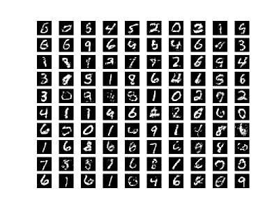
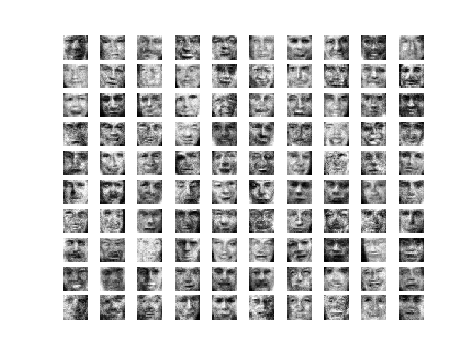
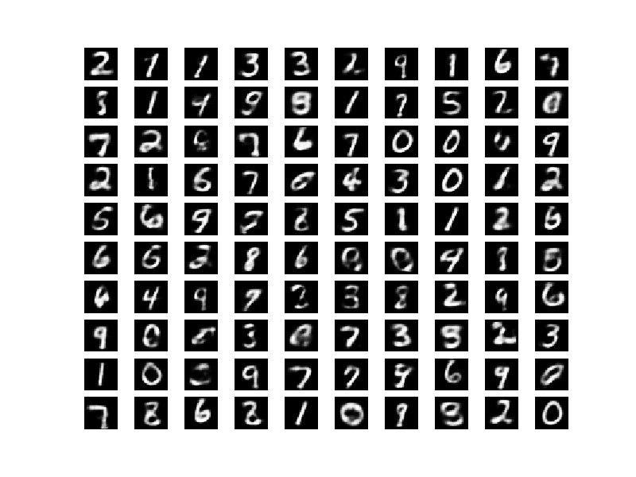
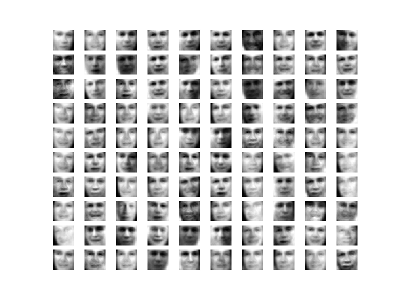

This is an implementation of the paper `Generative Moment Matching Networks, ICML 2015`. The paper can be found here: https://arxiv.org/abs/1502.02761. This implementation is in Python using Tensorflow.

#### Dependencies

The implementation depends on the following Python libraries:
`argparse, cPickle, math, matplotlib, numpy, random, tensorflow`

#### Usage

1. Extract the data from `data.tar.gz` into the same folder as that of the implementation `generativeMomentMatchingNetworks.py`. The data contains two files `mnist.pkl` and `lfw.npy`, for the MNIST and LFW datasets respectively. The implementation uses LFW as the TFD (which is used in the paper) is not publicly available.
2. The implementation `generativeMomentMatchingNetworks.py` needs two command line arguments to work, the dataset (`mnist, lfw`) and the network to be used (`data_space, code_space`; more in the paper). These can be specified by the `-d (or --dataset)` and `-n (or --network)` respectively.

Example Usage: `python generativeMomentMatchingNetworks.py -d mnist -n code_space`

#### Results

##### Data Space

 

##### Code Space

 
